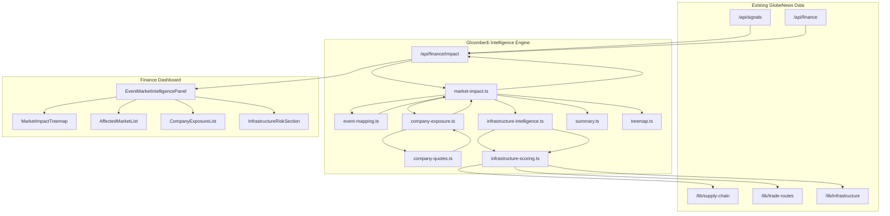

# GlobeNews × Gloomberb Integration

## Overview

The Gloomberb integration adds an event-driven market intelligence layer to the existing GlobeNews finance dashboard. It consumes live geopolitical signals, selects the highest-severity event, and scores affected markets, companies, supply-chain chokepoints and infrastructure nodes. The results are returned from the existing `/api/finance/impact` endpoint and rendered inside the existing `EventMarketIntelligencePanel` overlay.

This is a **Day 3 MVP**: the goal is a focused, production-grade feature set without new pages, animations, or unrelated refactoring. The implementation reuses existing GlobeNews datasets (`/lib/supply-chain`, `/lib/trade-routes`, `/lib/infrastructure`) and extends the current API surface rather than adding new endpoints.

## Architecture

## Module Reference

| File | Responsibility |
|------|----------------|
| `src/lib/gloomberb/types.ts` | Shared domain types: `GeopoliticalEvent`, `ScoredMarket`, `ScoredInfrastructureNode`, `EventMarketIntelligenceData`, etc. |
| `src/lib/gloomberb/event-mapping.ts` | Event-to-rule mapping. Rules match signals by keyword, region and category and emit scores. |
| `src/lib/gloomberb/market-impact.ts` | Main orchestrator. Selects the primary event, scores markets, drives company exposure and infrastructure intelligence. |
| `src/lib/gloomberb/company-exposure.ts` | Static company catalog, theme/sector scoring and live-quote amplification. |
| `src/lib/gloomberb/company-quotes.ts` | Yahoo chart fetcher and quote-merging helpers. |
| `src/lib/gloomberb/summary.ts` | Narrative summary generation and treemap item conversion. |
| `src/lib/gloomberb/treemap.ts` | Squarified treemap layout with tile-size pruning. |
| `src/lib/gloomberb/infrastructure-scoring.ts` | Scoring primitives for chokepoints, ports, routes and generic infrastructure nodes. |
| `src/lib/gloomberb/infrastructure-intelligence.ts` | Composite risk builder and logistics-implication generator. |
| `src/app/api/finance/impact/route.ts` | Next.js route handler that composes market data, live quotes and the intelligence engine. |
| `src/components/finance/EventMarketIntelligencePanel.tsx` | Main overlay panel. Renders summary, treemap, markets, companies and infrastructure risk. |
| `src/components/finance/InfrastructureRiskSection.tsx` | New panel section showing composite risk, chokepoints, routes, infrastructure and logistics. |

## Data Flow

1. `/api/finance/impact` fetches `/api/signals` and `/api/finance` in parallel.
2. `selectPrimaryEvent` picks the highest-severity, most recent signal.
3. `scoreMarketsForEvent` maps the event to `EVENT_MAPPING_RULES` and produces scored indices, commodities, forex and crypto entries.
4. Company scoring runs in two passes:
   - First pass uses theme/keyword/sector scoring without live quotes to determine the top-N candidates.
   - Only the top-N symbols are fetched via `fetchCompanyQuotesFromExisting`.
   - Final pass re-scores with the live quotes for display.
5. `buildInfrastructureIntelligence` scores chokepoints, ports, trade routes, pipelines, undersea cables, data centers and spaceports using keyword/region matching, criticality weights and event proximity when coordinates are available.
6. The engine assembles `EventMarketIntelligenceData` and returns it to the panel.
7. The panel renders the market summary, treemap, top affected markets, company exposure and the new infrastructure & supply-chain risk section.

## Key Design Decisions

- **No new API endpoints**: the payload is extended through the existing `/api/finance/impact` route, keeping client code simple and preserving backward compatibility. `infrastructureIntelligence` is optional in the response type.
- **Reuse existing data**: chokepoints, ports, routes, pipelines, cables, data centers and spaceports are sourced from the existing GlobeNews datasets; no duplicate datasets were created.
- **Two-pass company scoring**: avoids fetching live quotes for every company in the static catalog.
- **Geo-aware scoring**: `GeopoliticalEvent` now carries optional `lat`/`lon`. Infrastructure nodes use haversine proximity when coordinates are present, leaving text-only scoring as the fallback.
- **Existing UI patterns**: the new `InfrastructureRiskSection` reuses the panel’s compact glass/card styling, font sizes and color tokens.
- **No map integration in this MVP**: infrastructure nodes expose `lat`/`lon` in their underlying data so the map can be wired up later without engine changes.

## Type Safety

- All engine outputs are typed through `src/lib/gloomberb/types.ts`.
- `ScoredMarket<T>` and `ScoredInfrastructureNode<T>` use generic `data` fields so downstream components can access the underlying typed record.
- Infrastructure scoring uses `typeof DATASET[number]` to stay aligned with the static dataset shapes.

## Extensibility

- **New event types**: add entries to `EVENT_MAPPING_RULES` in `event-mapping.ts`.
- **New supply-chain/infrastructure data**: extend the arrays in `src/lib/supply-chain.ts`, `src/lib/trade-routes.ts` or `src/lib/infrastructure.ts`; the scoring engine will pick them up automatically.
- **New node categories**: extend `ScoredInfrastructureNode['type']` and add a scoring branch in `infrastructure-intelligence.ts`.
- **World map**: consume `lat`/`lon` from `GeopoliticalEvent` and the typed `data` field of each `ScoredInfrastructureNode`.

## Verification

- `npx tsc --noEmit` passes.
- `npm run build` passes.
- `/api/finance/impact` smoke test returns a valid payload including `infrastructureIntelligence`.
- The dashboard overlay renders the new **Infrastructure & Supply Chain Risk** section with the expected chokepoints, routes and composite risk score.

## Files Added / Modified

### Added
- `src/lib/gloomberb/infrastructure-scoring.ts`
- `src/lib/gloomberb/infrastructure-intelligence.ts`
- `src/components/finance/InfrastructureRiskSection.tsx`
- `GLOOMBERB_INTEGRATION.md`
- `GLOOMBERB_ARCHITECTURE.mmd`
- `GLOOMBERB_INTEGRATION_SUMMARY.md`

### Modified
- `src/lib/gloomberb/types.ts` — added infrastructure and geo types.
- `src/lib/gloomberb/market-impact.ts` — wired infrastructure intelligence and added event `lat`/`lon`.
- `src/lib/gloomberb/event-mapping.ts` — added module/function documentation; removed unused import.
- `src/lib/gloomberb/company-exposure.ts` — added module/function documentation.
- `src/lib/gloomberb/summary.ts` — added module/function documentation.
- `src/lib/gloomberb/treemap.ts` — added module/function documentation.
- `src/lib/gloomberb/infrastructure-scoring.ts` — added module/function documentation; removed unused re-exports.
- `src/lib/gloomberb/infrastructure-intelligence.ts` — added module/function documentation; removed unused supply-chain mapping import/re-export.
- `src/app/api/finance/impact/route.ts` — added module/function documentation.
- `src/components/finance/EventMarketIntelligencePanel.tsx` — added documentation and rendered the new infrastructure section.

### Removed
- `src/lib/gloomberb/supply-chain-mapping.ts` — unused dead code.
